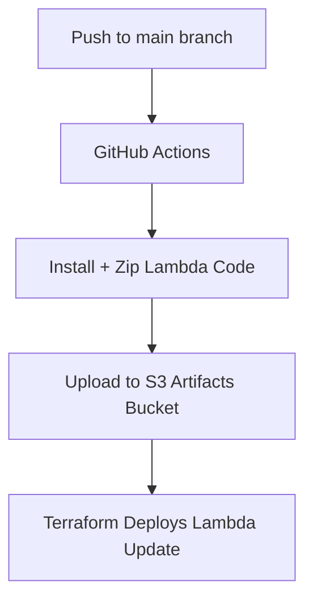

#  Macromate Lambdas

This folder contains all AWS Lambda functions used in the **Macromate** project.
Each folder under `lambdas/` is an independent service (e.g., `profile-service`) packaged and uploaded automatically using **GitHub Actions**.

---

## 📁 Structure

```
lambdas/
├── profile-service/
│   ├── index.js
│   ├── package.json
│   └── ...
└── other-services/
```

Each service:

* Has its own dependencies and build steps
* Is deployed as an independent AWS Lambda
* Uploads build artifacts to an S3 bucket (configured via Terraform)

---

## ⚙️ Development

To work on any Lambda:

```bash
cd lambdas/<service-name>
npm install
npm run start  # or node index.js
```

To create a new service:

```bash
mkdir lambdas/new-service
cd lambdas/new-service
npm init -y
```

---

## 🚀 Deployment

* Every time code under a `lambdas/<service-name>/` folder changes,
  the GitHub Actions workflow automatically:

  1. Installs dependencies
  2. Packages the code as a `.zip`
  3. Uploads it to the Lambda artifacts bucket

* Terraform later uses these uploaded zips to update AWS Lambda functions.

---

## 🧾 Workflow Summary



---

## 🧪 Local Testing

You can test a Lambda locally using mock events:

```bash
node index.js
```

or with AWS SAM (optional):

```bash
sam local invoke <FunctionName> -e events/test-event.json
```

---

